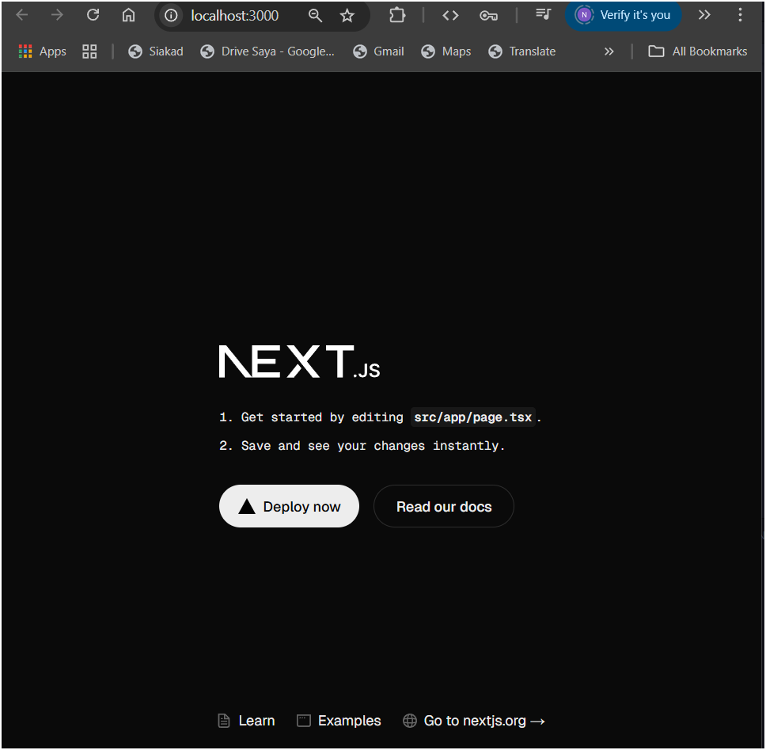
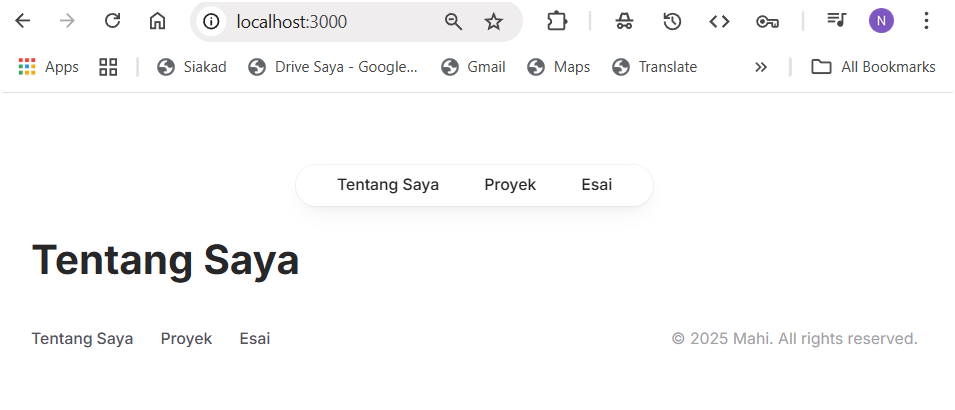
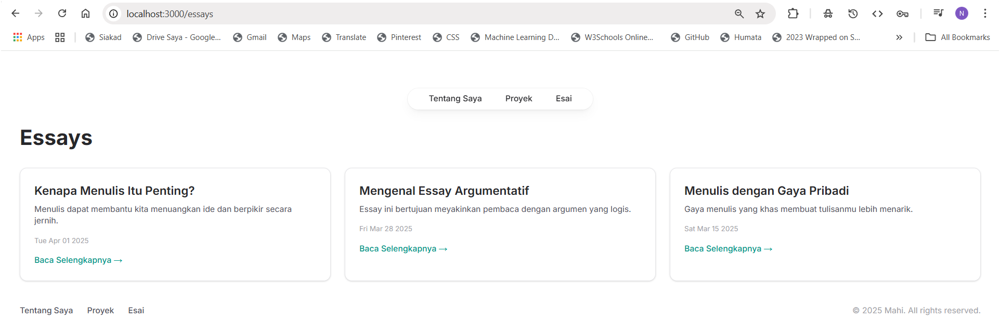
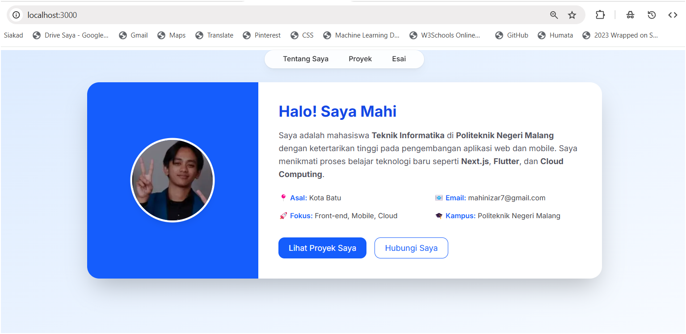

This is a [Next.js](https://nextjs.org) project bootstrapped with [`create-next-app`](https://nextjs.org/docs/app/api-reference/cli/create-next-app).

## Getting Started

First, run the development server:

```bash
npm run dev
# or
yarn dev
# or
pnpm dev
# or
bun dev
```

Open [http://localhost:3000](http://localhost:3000) with your browser to see the result.

You can start editing the page by modifying `app/page.tsx`. The page auto-updates as you edit the file.

This project uses [`next/font`](https://nextjs.org/docs/app/building-your-application/optimizing/fonts) to automatically optimize and load [Geist](https://vercel.com/font), a new font family for Vercel.

## Learn More

To learn more about Next.js, take a look at the following resources:

- [Next.js Documentation](https://nextjs.org/docs) - learn about Next.js features and API.
- [Learn Next.js](https://nextjs.org/learn) - an interactive Next.js tutorial.

You can check out [the Next.js GitHub repository](https://github.com/vercel/next.js) - your feedback and contributions are welcome!

## Deploy on Vercel

The easiest way to deploy your Next.js app is to use the [Vercel Platform](https://vercel.com/new?utm_medium=default-template&filter=next.js&utm_source=create-next-app&utm_campaign=create-next-app-readme) from the creators of Next.js.

Check out our [Next.js deployment documentation](https://nextjs.org/docs/app/building-your-application/deploying) for more details.

|  | Pemrograman Berbasis Framework 2025 |
|--|--|
| NIM |  2241720185|
| Nama |  Mochammad Nizar Mahi |
| Kelas | TI - 3B |

## Langkah Praktikum 
### 1. Persiapan Lingkungan 

### 2. Membuat halaman website (Home, Projek dan Essay)
#### - Halaman Home

#### - Halaman Projek

#### - Halaman Essay

### 3. Membuat Layout dan Navigasi

### 4. Membuat Halaman Proyek dengan Grid Responsif


## Tugas 
### 1. Modifikasi halaman "Esai" dengan Grid daftar artikel yang telah ditulis.

### 2. Modifikasi halaman “Tentang Saya” Buat tampilan yang menarik 

